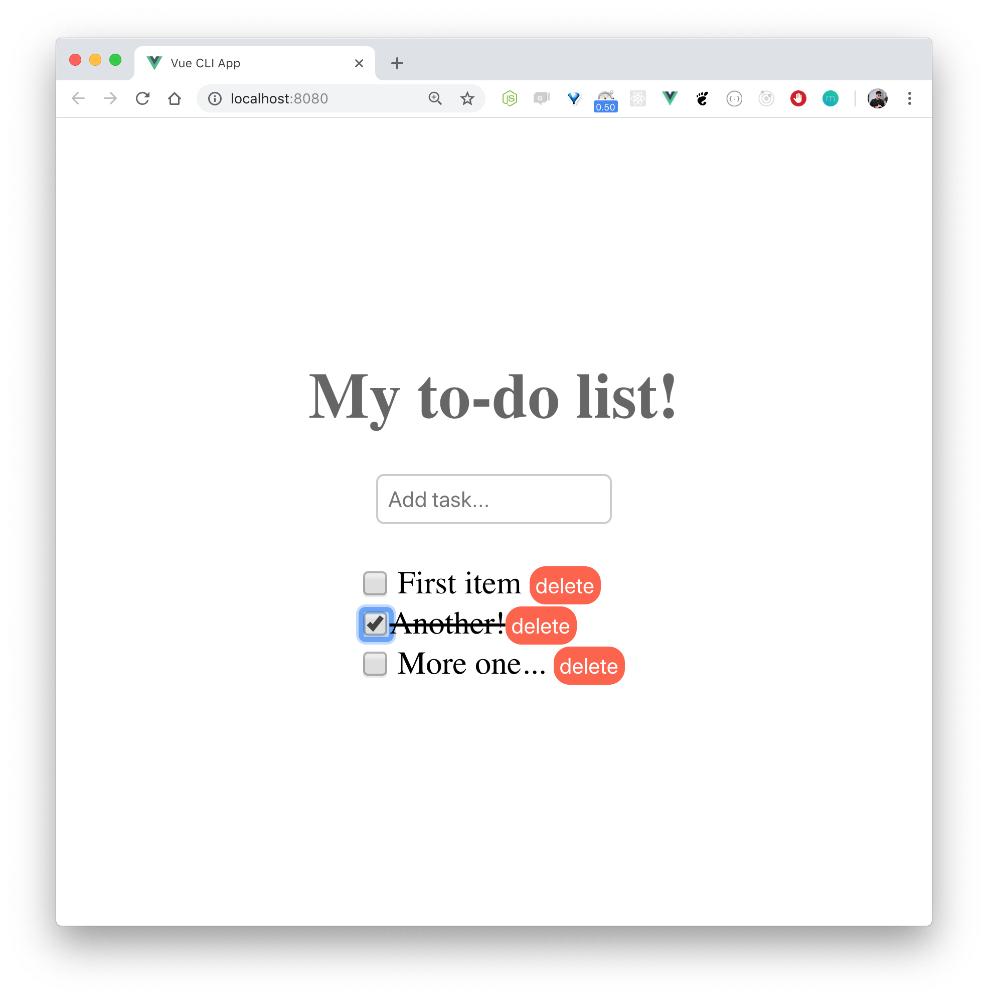

<p align="center">
  <h2 align="center">
    Simple to-do app demo to <a href="https://fatecdevday.com.br">Fatec dev day</a>
  </h2>
  <h3 align="center">
    <a href="https://speakerdeck.com/igorhalfeld/nativescript-vue">Slides</a>
  </h3>
</p>



### Run

```sh
npm install -g @vue/cli @vue/cli-service-global

# Vue command will be available
vue serve
# => localhost:8080
```
